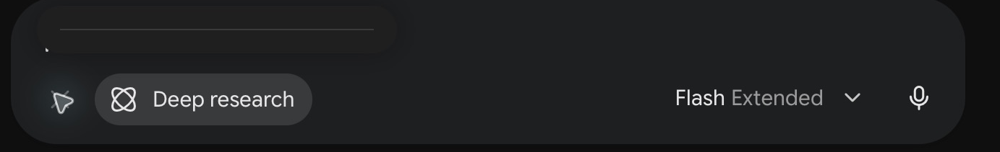
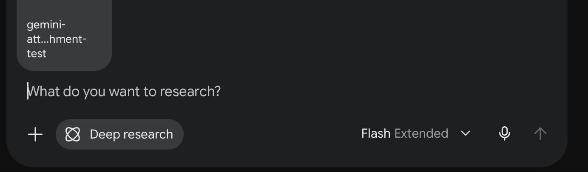
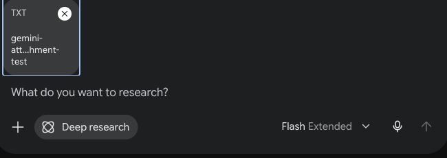

# Fresh browser comparison: October 7 UTC, 2026

**The original conversation still showed an empty attachment menu in the standalone Safari web app without the local patch. The same conversation worked in Chrome and Firefox without the patch.** This is one account and one conversation, not a claim that all Safari users are affected or that Gemini is broken in every desktop browser.

| Environment | Local compatibility script | Menu | Harmless TXT attachment |
|---|---|---|---|
| Safari standalone web app, Safari 27.0.1 | Disabled before fresh reload | Empty strip; no Upload files or Add from Drive | Unreachable through menu |
| Same Safari conversation | v1.2.0 restored, fresh reload | Both actions available | Loaded, then removed unsent |
| Chrome 154.0.8037.98, same conversation | Disabled before fresh load | Both actions available | Loaded, then removed unsent |
| Firefox 157.0.1, same conversation | Disabled before fresh load | Both actions available | Loaded, then removed unsent |

The installed AdGuard script was disabled and its setting inspected before unpatched page loads. Other protection settings were preserved. The script was restored to enabled afterwards. No cache or cookies were cleared, no account was signed out, and no test prompt was sent. Existing unrelated tabs and conversation content were preserved.

Safari's original affected conversation was reloaded for each side of the comparison. Chrome and Firefox used temporary tabs on the same conversation. The Firefox controller could not reliably inspect or interact with the page, so authorized native controls verified its menu and attachment. A controller error was not counted as a Gemini failure.

## Evidence

Safari without patch — empty menu immediately above the composer:

Safari with v1.2.0 — harmless attachment loaded:

Chrome without patch — harmless attachment loaded:

These images are privacy crops of the controls and harmless attachment. Conversation content, title, URL and account identity are excluded. Firefox's result was verified through native accessibility state; no public Firefox screenshot is claimed.

## Limits

- No fresh internal exception stack, Gemini deployment identifier or runtime script-execution marker was captured. The unpatched condition is evidenced by the disabled script setting before fresh loads.
- The observed Safari environment is the standalone Safari web app; an ordinary Safari tab was not tested in this comparison.
- The fresh result verifies the symptom and the local workaround's behavior. It does not independently re-establish the September internal mechanism in today's build.
- Attachment success means the file finished loading into the composer. No prompt was submitted and no model processing of that file was tested.
- Chrome and Firefox success disproves an all-three-tested-browsers failure for this conversation at this time; it does not establish when their behavior changed or how all other users behave.

[Machine-readable observations](evidence/browser-comparison-2026-10-07.json) · [Historical technical analysis](technical-analysis.md)
